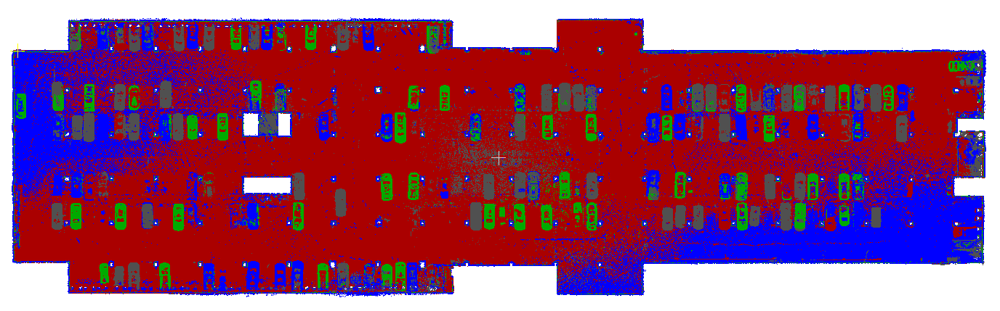

# **Sample Data**  
This repository provides a sample dataset to evaluate the performance of the TeeLabs mapping kit.

## **Dataset Description**  
The mapping results from the following devices are provided in PLY format.  
- Leica RTC360  
- NavVis VLX2  
- GeoSLAM ZEB Horizon 
- TeeLabs Mapping Kit  

### **Dataset Variants**
You can download the necessary data and review the PLY point cloud files using software that supports this format.  
1. **Whole Region**
    - Sampled data representing the entire mapped area.  
2. **Without Ceiling**
    - Ceiling regions removed for faster inspection of interior spaces.  
    - Useful for interior analysis or when ceiling details are not required.

### **Device-Specific Dataset Links**
**[Whole Region]**  
| Device             | Link          | File Size |  
|:------------------:|:-------------:|:---------:|  
| Leica RTC360       | [Download](https://drive-api.teevr.io/share/whole-region/Leica-RTC360.ply)  | 220 MB     |  
| NavVis VLX2        | [Download](https://drive-api.teevr.io/share/whole-region/NavVis-VLX2.ply)  | 351 MB     |  
| GeoSLAM ZEB Horizon| [Download](https://drive-api.teevr.io/share/whole-region/GeoSLAM-ZEB-Horizon.ply)  | 303 MB     |  
| TeeLabs Mapping Kit| [Download](https://drive-api.teevr.io/share/whole-region/TeeLabs-Mapping-Kit.ply)  | 247 MB     |  

**[Without Ceiling]**  
| Device             | Link          | File Size |  
|:------------------:|:-------------:|:---------:|  
| Leica RTC360       | [Download](https://drive-api.teevr.io/share/without-ceiling/Leica-RTC360.ply)  | 111 MB     |  
| NavVis VLX2        | [Download](https://drive-api.teevr.io/share/without-ceiling/NavVis-VLX2.ply)  | 170 MB     |  
| GeoSLAM ZEB Horizon| [Download](https://drive-api.teevr.io/share/without-ceiling/GeoSLAM-ZEB-Horizon.ply)  | 139 MB     |  
| TeeLabs Mapping Kit| [Download](https://drive-api.teevr.io/share/without-ceiling/TeeLabs-Mapping-Kit.ply)  | 121 MB     | 

## **Viewing the Data Using CloudCompare**  
Below is an example of how to view the data using **CloudCompare**, a popular open-source 3D point cloud processing tool.  

### **Steps to View the Data**  
1. **Download** the dataset you wish to review.  
2. **Install CloudCompare**  
   - Refer to the [installation guide](https://cloudcompare.org/release/index.html).  
   - Supported OS: Windows, macOS, Linux.  
3. **Load and View the Data**  
   - Assign unique colors to each dataset for easier comparison.  
   - To simplify the process, we provide **pre-configured CloudCompare Entity (.bin) files** with pre-applied color settings.  
    
       | Pre-configured Files | Link          | File Size |  
       |:--------------------:|:-------------:|:---------:| 
       | Whole Region         | [Download](https://drive-api.teevr.io/share/whole-region/pre-configured-whole-region.bin)  | 1.1 GB    |  
       | Without Ceiling      | [Download](https://drive-api.teevr.io/share/without-ceiling/pre-configured-without-ceiling.bin)  | 522 MB    |  

### **Example View**  
Below is an example view to demonstrate dataset differences by color.  

<table>
    <tr>
        <td rowspan="4">        
        <td>Leica RTC360</td>
        <td>Grey</td>        
    </tr>
    <tr>        
        <td>NavVis VLX2</td>
        <td>Green</td>
    </tr>
    <tr>        
        <td>GeoSLAM ZEB Horizon</td>
        <td>Blue</td>
    </tr>
    <tr>        
        <td>TeeLabs Mapping Kit</td>
        <td>Red</td>
    </tr>
</table>

## **Notes and Troubleshooting**  
- Ensure that your system meets the minimum requirements for **CloudCompare**.  
- If a dataset fails to load, verify that your software version supports the PLY format.  
- For any questions, contact support at [help@teevr.com](mailto:help@teevr.com).  

## **Terms of Use**  
- This dataset is provided under the ownership of TeeLabs, all rights reserved.  
- Redistribution or commercial use is prohibited without prior permission.  
